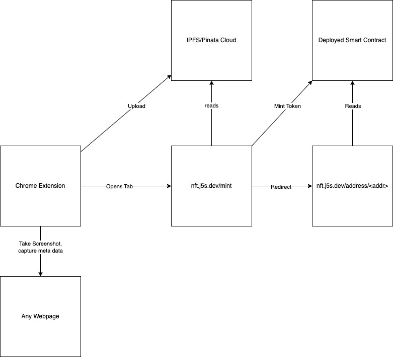
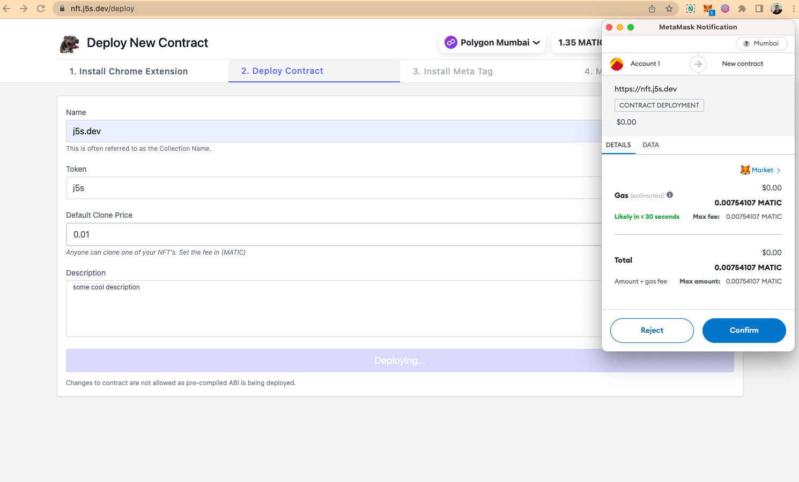
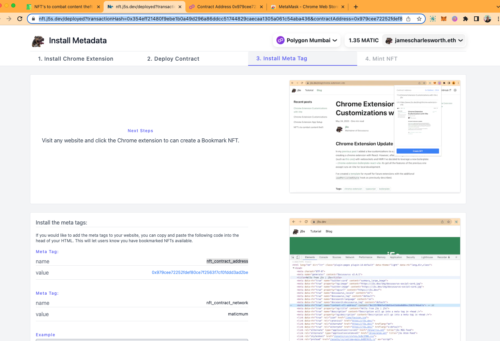
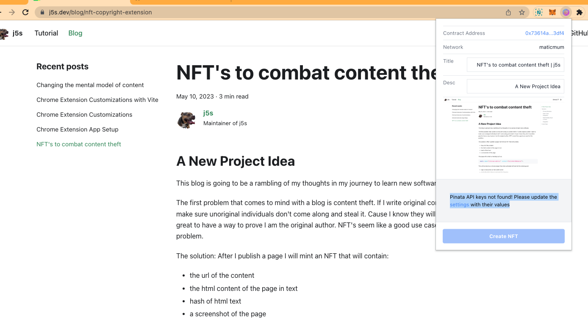
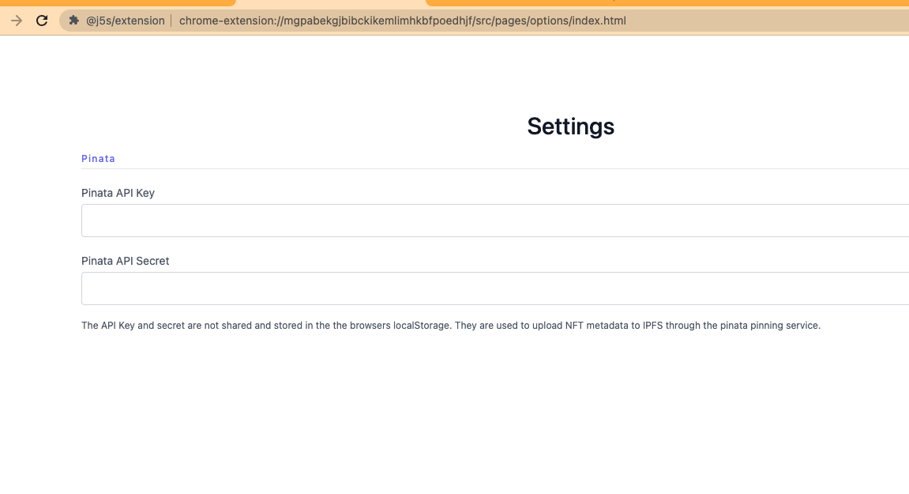
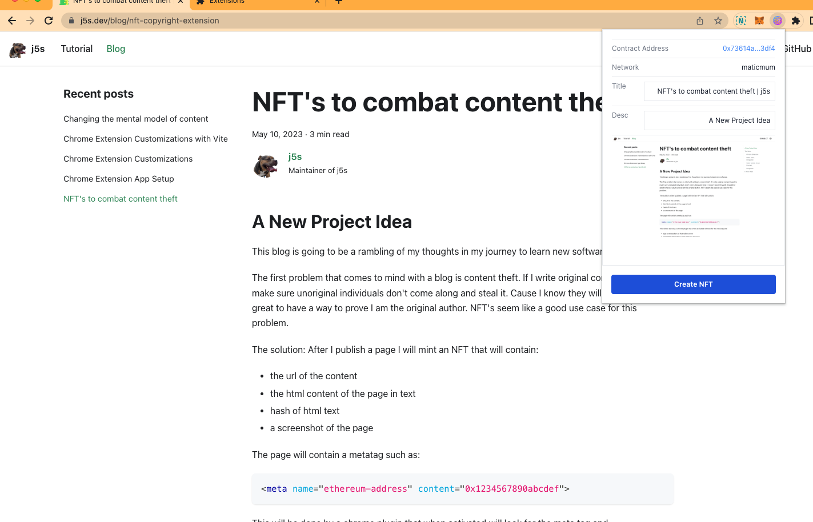
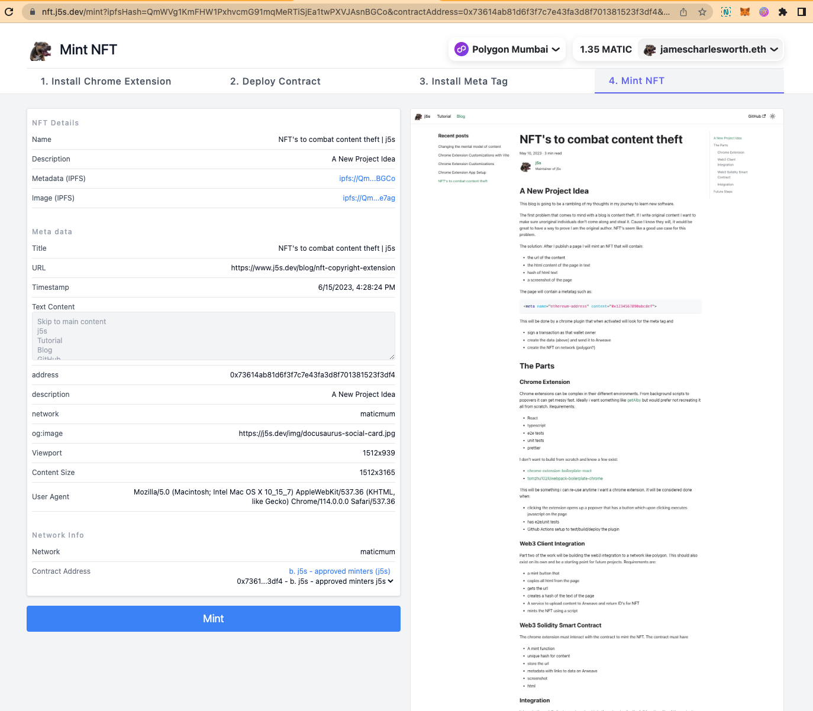
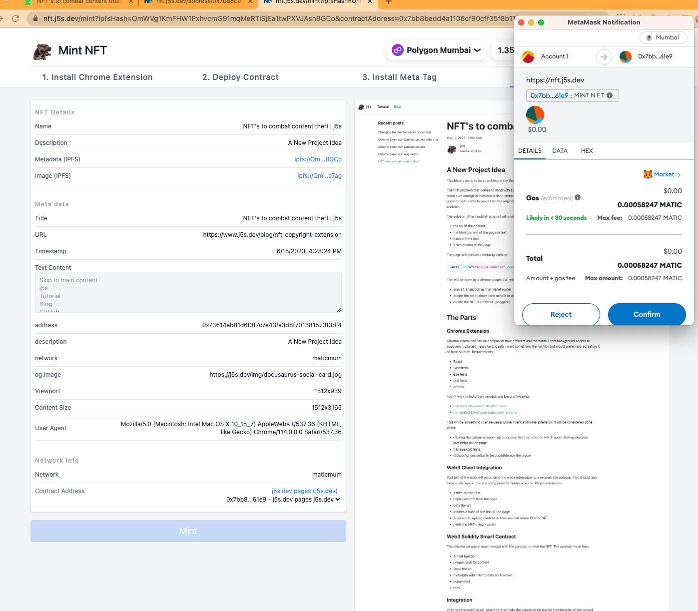
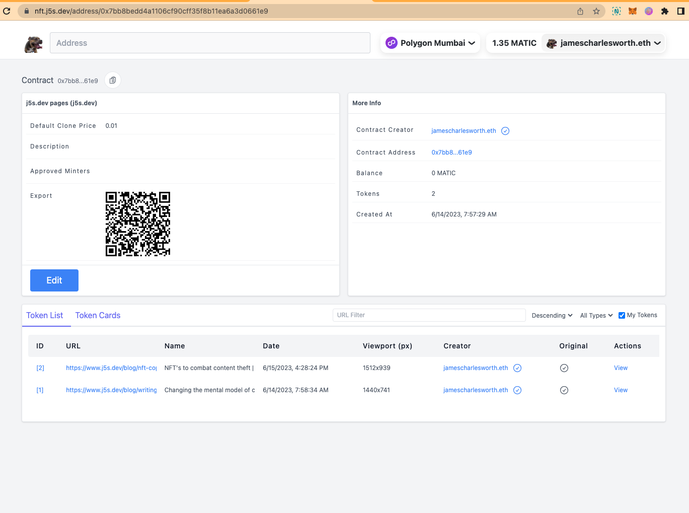

# nft.j5s.dev

This documentation is written for my future self and any curios developers looking to play around with smart contracts, chrome extensions, and React. It requires some knowledge of frontend software development and Ethereum blockchain.

Technologies used are:

- [Typescript](https://www.typescriptlang.org/)
- [Vite](https://vitejs.dev/)
- [React](https://react.dev/)
- [Next](https://nextjs.org/)
- [NX](https://nx.dev/)
- [Solidity](https://soliditylang.org/)
- [Hardhat](https://hardhat.org/)
- [Jest](https://jestjs.io/) (React tests)
- [Mocha](https://mochajs.org/) (smart contract tests)

This project is a monorepo repo containing 2 apps and 1 library:

#### Apps

- [./apps/extension/](./apps/extension/) - Chrome Extension - React
- [./apps/nft-j5s-dev/](./apps/nft-j5s-dev/) - React Dapp ([j5s.nft.dev](https://nft.j5s.dev/) website)

Library

- [./libs/contracts/](./libs/contracts/) - Solidity Smart contract

Architectural Diagram / Flow



## The Inspiration / Idea

When creating [a blog](https://www.j5s.dev/blog) I thought it would be possible someone would steal my content at some point given the [duplicate results on Google](https://www.searchenginejournal.com/google-answers-why-entire-top-10-is-stolen-content/434317/#close).

This sparked [an idea](https://www.j5s.dev/blog/nft-copyright-extension) of using NFT's to timestamp content for verifiable proof of ownership. As many of my side projects do, the idea has grown a bit and changed. Although it's original purpose is still intact, its other purpose is now a book marking engine. I plan on using it to host my bookmarks of my own content as well as my favorite content from other parts of the internet. Sometimes I find [a post so good](https://jacob.energy/hyperstructures.html) it deserves to be minted.

## How to use

### pre-requisites

- [Chrome metamask extension](https://chrome.google.com/webstore/detail/metamask/nkbihfbeogaeaoehlefnkodbefgpgknn)
- Some Matic or Ether in your wallet
  - Polygon Mumbai and Ethereum Sepolia testnets are available for testing

### Step 1: Deploy

Deploy a smart contract on [nft.j5s.dev/deploy](https://nft.j5s.dev/deploy)


This will deploy the contract to the blockchain, such as [this one](https://mumbai.polygonscan.com/address/0x979cee72252fdef80ce7f2563f7cf0fddd3ad2be) on Polygon Mumbai.

After deploying you will be redirect to the [/deployed](https://nft.j5s.dev/deployed?transactionHash=0x354eff21480f9ebe1b0a49d296a86ddcc51744829caecaa1305a061c54aba436&contractAddress=0x979cee72252fdef80ce7f2563f7cf0fddd3ad2be) page
 with next steps.

### Step 2: Capture Image/Data

The chrome extension is not published and you will need to build it and load it into chrome.

#### Building the plugin

Clone and install:

```
git clone git@github.com:j-5-s/bookmark-nft.git
cd bookmark-nft
yarn install
```

Build the extension

```
nx build @j5s/extension
```

This will build the extenion in `/dist/apps/extension`.
Navigate to [chrome://extensions](chrome://extensions) and click "Load unpacked extension". Select the dist folder above.

#### Connecting to Pinata

The extension uses [Pinata](https://www.pinata.cloud/) pinning service to upload metadata and the screenshot to [IPFS](https://ipfs.tech/). You will need to sign up for an account and get an API Key and secret.

Add your keys to the extension (the keys are only used on your machine to interact with the pinata api and not sent anywhere else).

Click the link to set your key


Set the key


After setting the key you will be able to create a NFT from a screenshot:



### 3.Minting the NFT

After clicking Mint NFT you will arrive at the `/mint` page:


Above the mint button you will need to select the contract you would like to mint to. Select the contract that you initially deployed and click Mint.



This will trigger Metamask to ask you to confirm your transaction. After doing so you will be taken to the contract display page:



# Next steps

I'd like to continue developing the idea and be able to easily compare changes of given url over time. I'm of the opinion that [content should be living](https://www.j5s.dev/blog/writing) documents and that a blog post or article can and should be updated over time as your position and understanding evolves.

- Integrating history of tokens for given url into extension
  - [react diff viewer](https://praneshravi.in/react-diff-viewer/) for text

## License

The MIT License (MIT)

Copyright (c) 2023 James Charlesworth

Permission is hereby granted, free of charge, to any person obtaining a copy of this software and associated documentation files (the "Software"), to deal in the Software without restriction, including without limitation the rights to use, copy, modify, merge, publish, distribute, sublicense, and/or sell copies of the Software, and to permit persons to whom the Software is furnished to do so, subject to the following conditions:

The above copyright notice and this permission notice shall be included in all copies or substantial portions of the Software.

THE SOFTWARE IS PROVIDED "AS IS", WITHOUT WARRANTY OF ANY KIND, EXPRESS OR IMPLIED, INCLUDING BUT NOT LIMITED TO THE WARRANTIES OF MERCHANTABILITY, FITNESS FOR A PARTICULAR PURPOSE AND NONINFRINGEMENT. IN NO EVENT SHALL THE AUTHORS OR COPYRIGHT HOLDERS BE LIABLE FOR ANY CLAIM, DAMAGES OR OTHER LIABILITY, WHETHER IN AN ACTION OF CONTRACT, TORT OR OTHERWISE, ARISING FROM, OUT OF OR IN CONNECTION WITH THE SOFTWARE OR THE USE OR OTHER DEALINGS IN THE SOFTWARE.
